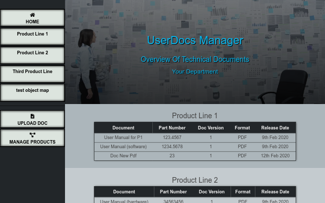

# UserDocs Manager

[Live Demo](https://user-docs-manager.now.sh/)

## Description

### Functional Description
The purpose of this app is to serve as a small, yet not over-complicated content management system for small to mid-range organizations to help them manage their user/technical documentation
#### Easy Access and Overview to User Documentation

- Get quick overview of all stored documents, ordered by product groups. Get information on topic, format, release date, article and version number, as well as description.

- Open PDF documents directly in your browser. Other file types are either directly opened or downloaded for further use when clicking on the OPEN button (depending on your operating system and/or and the settings of your browser).
#### Upload Documents

- Upload new user documentation and use the settings wizard to provide all the required data, then assign it to the respective product group.

- The following file formats are supported: PDF, DOCX, XSL, ZIP, PNG/JPG
#### Manage Product Groups
- Create new product groups or delete existing ones. Once created, you can assign uploaded documents to better organize your user documentation.

### Technical Description
- **React Context API** is used in this application for the front-end.

-  **AWS S3** is used to store the documents. To upload to the S3 Bucket a  request is made to the /upload endpoint. 

-  An AWS S3 service object is implemented on the server to manage the /upload endpoint and send back a signed request to the client.

- The API calls are made to a **PostgreSQL database**.

- **SQL** migration scripts are used to create the database with tables for products and documents including relationships and CASCADES.

- A **Node.js/Express** server with routers handles the endpoints.

## API
The following API endpoints are used in this application:

 - `GET /`
  	- responds with "Hello UserDocs API". Use to quickly test if the server is running
  	

- `GET /api/products`
 	- returns a list of all product groups
 
- `GET /api/products/:product_id`
 	- returns a specific product group specified by the id
 
 - `POST /api/products`
 	- inserts a new product group into the products table

- `DELETE /api/products/:product_id`
  - deletes a specific product group by the specified id

- `POST /api/upload/`
  - sends a request to the AWS S3 API and returns a signed request to the client
  
- `GET /api/docs`
  - returns a list of all documents
  
 - `GET /api/docs/:document_id`
 	- returns a specific document by the specified id

- `POST /api/docs`
 	- inserts a new document into the documents table

NOTE: The routers also handle further CRUD operations on the endpoints (such as PATCH), which are not used within the functional scope of this application. However, you can still use them to extend the functionality of the app.

## Setup
### Setting up the API
1. Clone the API repository which is located here: [UserDoc-Manager-API](https://github.com/vansky17/UserDoc-Manager-API.git)

2. Change to the directory on your computer that contains this API repo.

3. Install dependencies: `npm install`
 
4. Create an S3 Bucket at [https://aws.amazon.com/en/console/](https://aws.amazon.com/en/console/) and set the access rights accordingly.
   
5. Configure Postgres and create the database user (as a superuser): `createuser -s userdoc-manager` 

6. Create the "development" and "test" PostgreSQL databases.
`createdb -U userdoc-manager userdocdb`
`createdb -U userdoc-manager userdocdb-test`

7. Prepare environment file: `cp example.env .env` and add the following values:
  - `PORT=8000`
  - `DATABASE_URL="postgresql://<user>@localhost/<name of the database>"`
  - `TEST_DATABASE_URL="postgresql://<user>@localhost/<name of the test database>"`
  - `AWS_ACCESS_KEY = "<Your Key>"`
  - `AWS_SECRET_ACCESS_KEY = "<Your Secret Key>"`
  - `S3_BUCKET_NAME = "<name of your bucket>"`

8. Create development and test database tables:
   - `npm run migrate`
   - `npm run migrate:test`

9. Use `seed.docs.sql ` and `seed.products.sql` in the "seeds" folder to populate the tables. 
	- `psql -U userdoc-manager -d userdocdb -f ./seeds/seed.products.sql`
	- `psql -U userdoc-manager -d userdocdb -f ./seeds/seed.products.sql`
   
10. Run the server: `npm start`
### Setting up the Client

2. Clone this repository

3. In the terminal, change to the directory on your computer that contains this repo

4. Install dependencies: `npm install`
   
5. Change the back-end API endpoint in `./src/config.js` 

6. Start the app in a web browser: `npm start`

